# FX Trading Tracker - User Manual

**Version 2.0** | August 2026

---

## Table of Contents

1. [Introduction](#1-introduction)
2. [Getting Started](#2-getting-started)
3. [Dashboard](#3-dashboard)
4. [My Deals (Trader)](#4-my-deals-trader)
5. [New Deal Ticket](#5-new-deal-ticket)
6. [Deal Queue (Treasury)](#6-deal-queue-treasury)
7. [Reference Data Management (Admin)](#7-reference-data-management-admin)
8. [User Management (Admin)](#8-user-management-admin)
9. [Transaction History (Admin)](#9-transaction-history-admin)
10. [Audit Trail (Admin)](#10-audit-trail-admin)
11. [Reports](#11-reports)
12. [System Administration](#12-system-administration)
13. [Appendix: Transfer Types Reference](#13-appendix-transfer-types-reference)

---

## 1. Introduction

The FX Trading Tracker is a web-based platform for managing foreign exchange deal tickets across a multi-role operational workflow. It supports the full deal lifecycle from ticket creation through treasury processing, with audit logging, settlement proof management, and comprehensive reporting.

### 1.1 User Roles

The platform supports four distinct user roles, each with specific permissions:

| Role | Access Level |
|------|-------------|
| **Trader** | Create deal tickets, upload client proofs, view own deals, generate reports |
| **Treasury** | Review and process deals (confirm/return), upload processor proofs, generate reports |
| **Admin** | Manage users, reference data, audit trail, report permissions, bulk imports |
| **System Admin** | Full admin access plus database reset, system exports, and database statistics |

### 1.2 Key Concepts

- **Deal Ticket**: An FX trade record containing client details, currencies, amounts, rates, and bank/crypto account information.
- **Settlement Proof**: Documentary evidence (images or PDFs) of fund transfers uploaded by traders (client proofs) or treasury (processor proofs).
- **Reference Data**: System-wide master data including FX clients, banks, currencies, counterparties, transaction types, and transfer types.
- **Counterparty**: A PJL Group entity (e.g., CLSC, PJ, Verite) used instead of "company" for FX Local, FX - Corporate Settlement, and FX-Intercompany transfers.

---

## 2. Getting Started

### 2.1 Logging In

Navigate to the application URL in your web browser. The Sign In page will display.

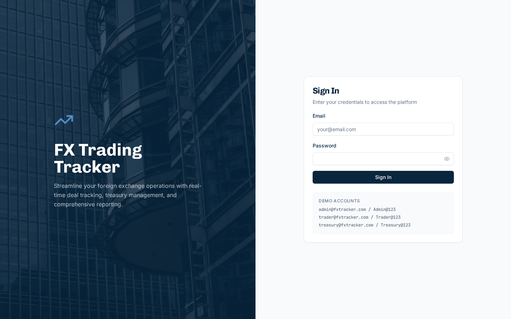

*Figure 2.1 - Sign In page with demo credentials displayed*

1. Enter your **Email** address.
2. Enter your **Password**.
3. Click **Sign In**.

Upon successful authentication, you will be redirected to the Dashboard.

### 2.2 Navigation

The left sidebar provides navigation to all available pages based on your role:

**Trader Navigation:**
- Dashboard
- My Deals
- New Deal
- Reports

**Treasury Navigation:**
- Dashboard
- Deal Queue
- Reports

**Admin Navigation:**
- Dashboard
- Reference Data
- Users
- Transactions
- Audit Trail
- Reports

### 2.3 Changing Your Password

1. Click **Change Password** in the bottom-left sidebar.
2. Enter your current password.
3. Enter your new password (minimum 4 characters).
4. Click **Update Password**.

### 2.4 Logging Out

Click **Logout** at the bottom of the sidebar to end your session.

---

## 3. Dashboard

The Dashboard provides an at-a-glance overview of trading activity.

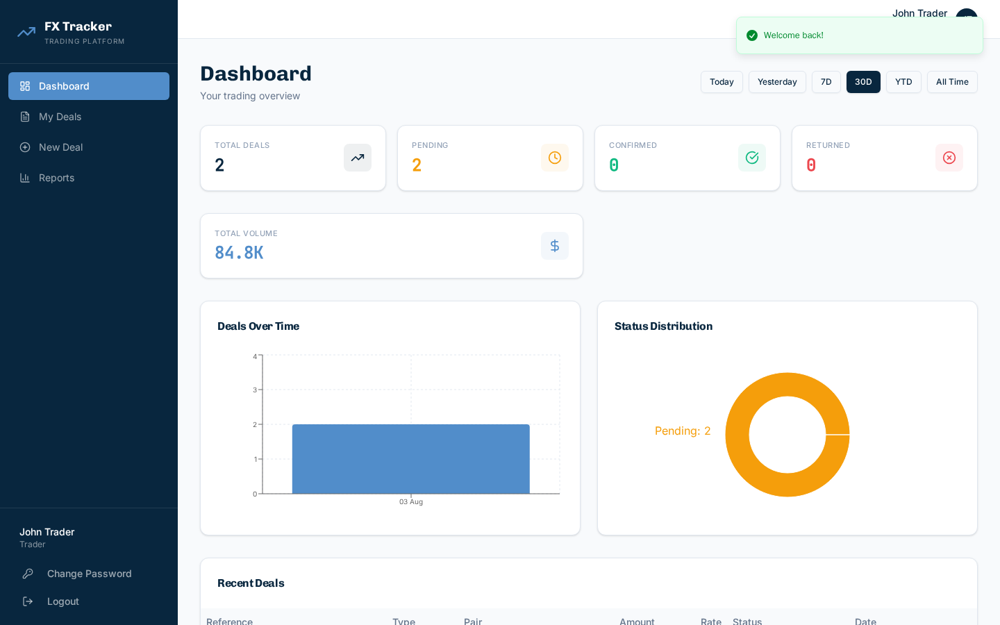

*Figure 3.1 - Trader Dashboard showing deal statistics and charts*

### 3.1 Summary Cards

The top row displays key metrics:
- **Total Deals** - Number of deals in the selected period.
- **Pending** - Deals awaiting treasury review.
- **Confirmed** - Deals confirmed by treasury.
- **Returned** - Deals returned for correction.

### 3.2 Date Range Filters

Use the date buttons in the top-right corner to change the reporting period:
- **Today** / **Yesterday** / **7D** / **30D** / **YTD** / **All Time**

### 3.3 Charts

- **Deals Over Time** - Bar chart showing deal volume over the selected period.
- **Status Distribution** - Doughnut chart showing deal status breakdown.

> **Note**: Traders see only their own deal data. Admins and Treasury see all deals.

---

## 4. My Deals (Trader)

The My Deals page is the primary workspace for traders to manage their deal tickets.

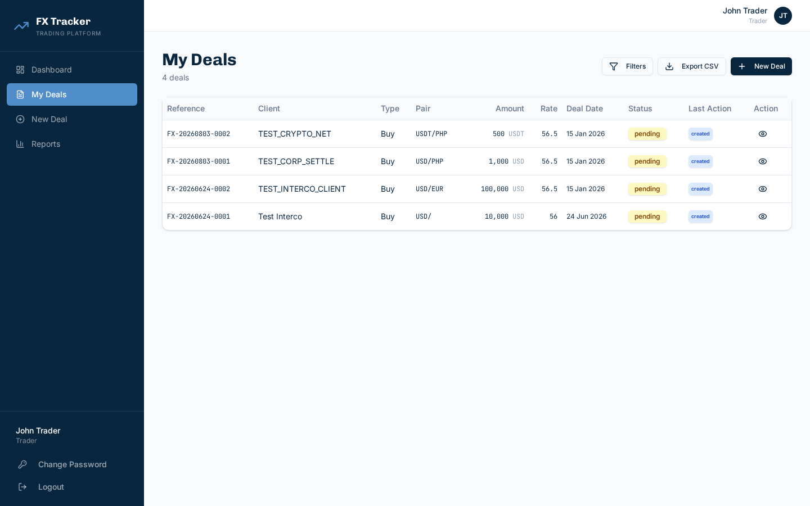

*Figure 4.1 - My Deals list showing Amount with currency label and Last Action badges*

### 4.1 Deal List

The table displays all your deals with the following columns:

| Column | Description |
|--------|-------------|
| **Reference** | Unique deal reference (e.g., FX-20260803-0001) |
| **Client** | Client/company name |
| **Type** | Transaction type (Buy or Sell) |
| **Pair** | Currency pair (e.g., USD/PHP) |
| **Amount** | Original currency amount with currency label (e.g., 1,000 USD) |
| **Rate** | Exchange rate |
| **Deal Date** | Date of the deal |
| **Status** | Current status badge (pending, confirmed, returned, cancelled) |
| **Last Action** | Most recent action badge from deal history |
| **Action** | View button to open deal details |

### 4.2 Filtering Deals

Click the **Filters** button to reveal filter controls:
- **Status** - Filter by deal status.
- **Client** - Search by client name.
- **Currency** - Filter by currency code.
- **Date From / Date To** - Date range filter.

Click **Clear Filters** to reset all filters.

### 4.3 Exporting Deals

Click **Export CSV** to download all visible deals as a CSV file.

### 4.4 Viewing Deal Details

Click the eye icon on any deal row to open the deal detail dialog.

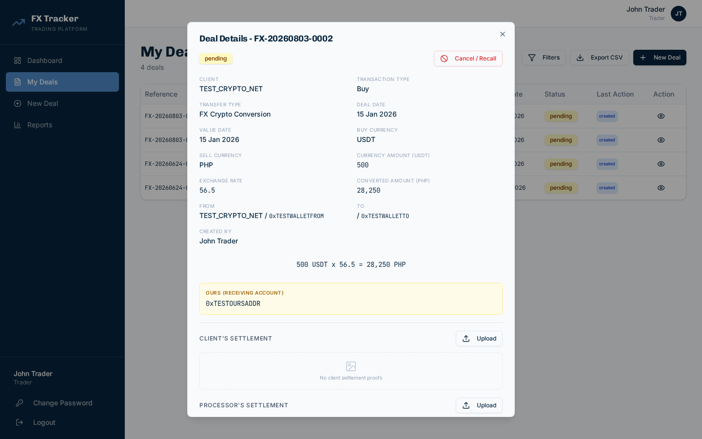

*Figure 4.2 - Deal detail dialog with full deal information and settlement proofs*

The dialog shows:
- All deal fields (client, dates, currencies, amounts, bank accounts)
- Currency conversion summary (e.g., 500 USDT x 56.5 = 28,250 PHP)
- Ours (Receiving Account) details
- Client and Processor settlement proofs
- Full deal history timeline

### 4.5 Uploading Settlement Proofs

For pending or returned deals:
1. Open the deal detail dialog.
2. Under **Client's Settlement**, click **Upload**.
3. Select one or more image files (JPEG, PNG, WebP, GIF) or PDFs.
4. The proof(s) will be uploaded and displayed in the proof grid.

> **Note**: Client settlement proofs are not applicable for FX Bank Deal transactions.

### 4.6 Cancelling a Deal

For pending deals only:
1. Open the deal detail dialog.
2. Click **Cancel / Recall**.
3. Enter a cancellation reason (required).
4. Click **Confirm Cancellation**.

### 4.7 Editing a Returned Deal

When treasury returns a deal:
1. A red alert box will show the treasury's return remarks.
2. Click **Edit Deal** to modify the deal fields.
3. After editing, choose:
   - **Save Changes** - Save without resubmitting.
   - **Save & Resubmit** - Save changes and resubmit to treasury.
4. Or click **Resubmit** to resubmit as-is without changes.

---

## 5. New Deal Ticket

Create a new FX trade deal ticket from the New Deal page.

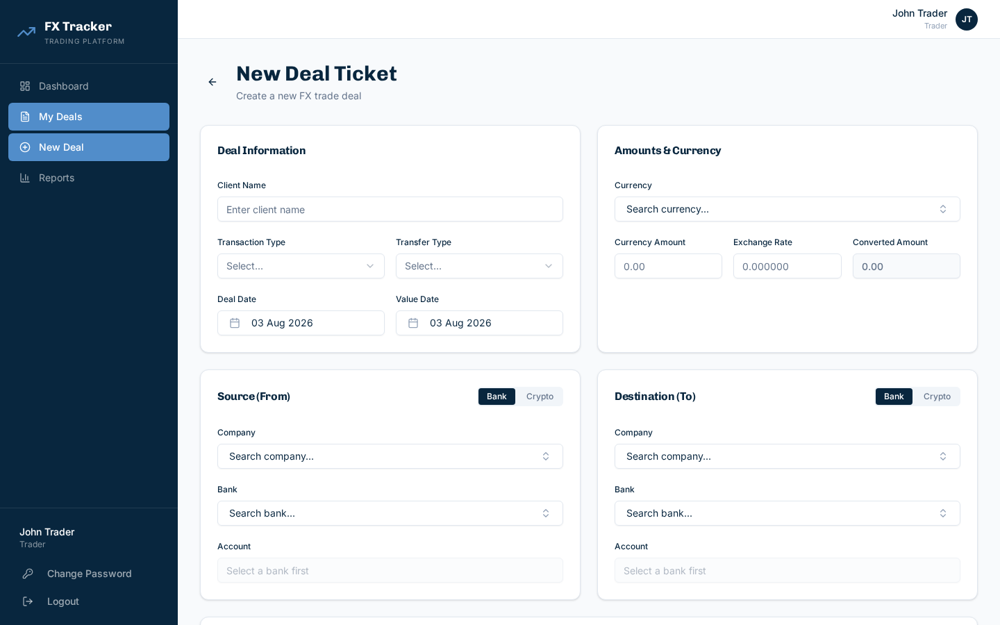

*Figure 5.1 - New Deal Ticket form with Deal Information, Amounts, Source, and Destination sections*

### 5.1 Deal Information

| Field | Required | Description |
|-------|----------|-------------|
| Client Name | Yes | Free-text client name |
| Transaction Type | Yes | Select **Buy** or **Sell** |
| Transfer Type | Yes | Select from available types (see Appendix) |
| Deal Date | Yes | Date of the deal |
| Value Date | Yes | Settlement value date |

### 5.2 Amounts and Currency

| Field | Required | Description |
|-------|----------|-------------|
| Currency | Yes | Searchable dropdown with fiat, stablecoin, and crypto currencies |
| Currency Amount | Yes | The principal amount in the selected currency |
| Exchange Rate | Yes | The FX conversion rate |
| Converted Amount | Auto | Automatically calculated as Currency Amount x Rate |

### 5.3 Source (From) and Destination (To)

Each section supports **Bank** or **Crypto** mode, toggled via the Bank/Crypto switch.

**Bank Mode:**
- **Company** or **Counterparty** (depending on transfer type) - Searchable dropdown.
- **Bank** - Searchable dropdown from reference data.
- **Account** - Searchable autocomplete showing both account name and number.

**Crypto Mode:**
- **Company** or **Counterparty** - Searchable dropdown.
- **Wallet Address** - Free text crypto wallet address.
- **Network** - Required dropdown: **SOLANA**, **ETHEREUM**, or **TRON**.

> **Important**: When the Source or Destination type is set to Crypto, you must select a blockchain network. This ensures proper routing of crypto transactions.

### 5.4 Ours (Receiving Account)

This section defines where the counterparty credits funds. It supports the same Bank/Crypto modes.

For **FX-Intercompany** deals, two Ours sections appear:
- **Selling Counterparty Ours** - The selling side receiving account.
- **Buying Counterparty Ours** - The buying side receiving account.

### 5.5 Settlement Proofs

Optionally upload settlement proofs during deal creation:
- **Client's Settlement** - Proofs from the client side.
- **Processor's Settlement** - Proofs from the processing side.

### 5.6 Submitting the Deal

1. Fill in all required fields.
2. Click **Submit Deal Ticket**.
3. Review the confirmation dialog with all deal details.
4. Click **Confirm & Submit** to create the deal.

The deal will be assigned a unique reference number (e.g., FX-20260803-0001) and placed in **pending** status for treasury review.

---

## 6. Deal Queue (Treasury)

The Deal Queue is the treasury team's workspace for reviewing and processing FX deals.

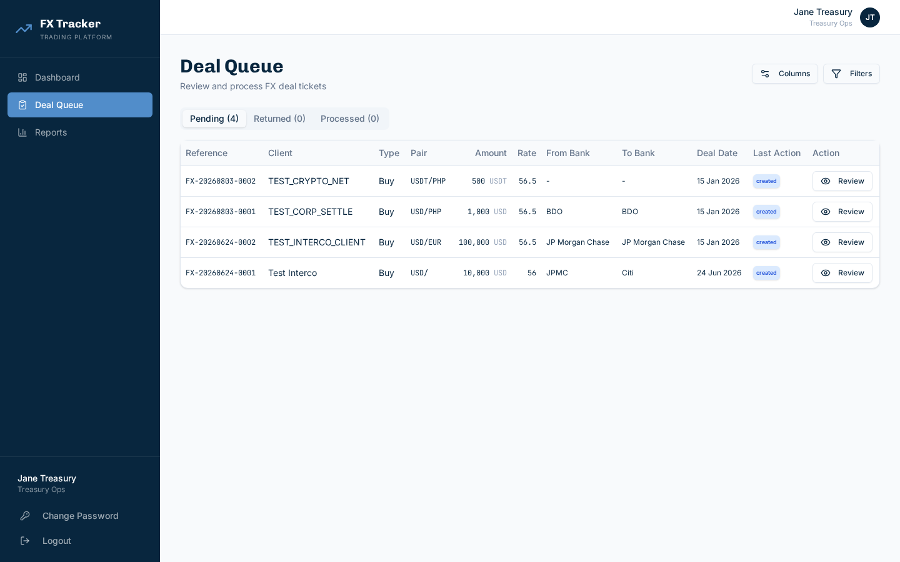

*Figure 6.1 - Treasury Deal Queue with Pending, Returned, and Processed tabs*

### 6.1 Queue Tabs

| Tab | Contents |
|-----|----------|
| **Pending** | Deals awaiting treasury review |
| **Returned** | Deals previously returned, awaiting trader correction |
| **Processed** | Confirmed and cancelled deals |

### 6.2 Table Columns

The table shows:
- Reference, Client, Type, Pair, Amount (currency amount with label), Rate
- From Bank, To Bank, Deal Date
- **Last Action** - Most recent action badge (created, confirmed, returned, etc.)
- Status (on Processed tab)
- Action button (Review / View)

### 6.3 Customizing Columns

Click the **Columns** button to show/hide individual columns using toggle switches.

### 6.4 Filtering

Click **Filters** to access:
- Client name search
- Currency filter
- From Bank / To Bank dropdown filters
- Date range filters

### 6.5 Reviewing a Deal

1. Click **Review** on a pending deal row.
2. The review dialog opens with complete deal details including:
   - All deal information and bank/crypto details
   - Client's Settlement proofs (view-only for treasury)
   - Processor's Settlement proofs (treasury can upload and manage)
   - Deal history timeline
3. Enter **Treasury Remarks** (required for all actions).

### 6.6 Uploading Processor Proofs

In the review dialog, under **Processor's Settlement**:
1. Click **Upload**.
2. Select proof files (images or PDF).
3. The proofs will appear in the proof grid.

### 6.7 Confirming a Deal

1. Enter treasury remarks.
2. Click **Confirm** (green button).
3. A confirmation prompt will appear. Click **Yes, Confirm**.

> **Note**: At least one settlement proof (client or processor) must exist before a deal can be confirmed. The Confirm button is disabled when zero proofs are uploaded.

### 6.8 Returning a Deal

1. Enter treasury remarks explaining the reason for return.
2. Click **Return** (red button).
3. A confirmation prompt will appear. Click **Yes, Return**.

The deal will be sent back to the trader with the return remarks.

---

## 7. Reference Data Management (Admin)

Admins manage all system reference data from the Reference Data page.

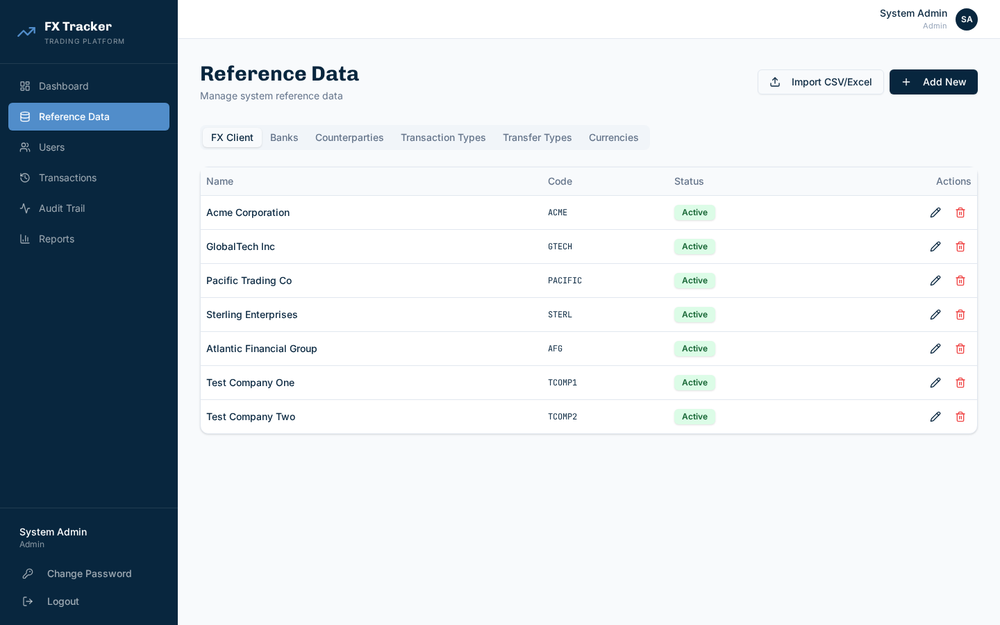

*Figure 7.1 - Reference Data page showing the FX Client tab with Import CSV/Excel button*

### 7.1 Data Categories

The page has six tabs:

| Tab | Description |
|-----|-------------|
| **FX Client** | Client/company entities (formerly "Companies") |
| **Banks** | Banking institutions with SWIFT codes and account management |
| **Counterparties** | PJL Group entities (CLSC, PJ, Verite, etc.) |
| **Transaction Types** | Buy / Sell |
| **Transfer Types** | FX Crypto Conversion, FX Local, FX Bank Deal, FX-Intercompany, FX - Corporate Settlement, PDAX Withdrawal |
| **Currencies** | Fiat, stablecoin, and cryptocurrency codes |

### 7.2 Adding Items

1. Navigate to the desired tab.
2. Click **Add New**.
3. Fill in the required fields:
   - **Name** and **Code** (all tabs)
   - **SWIFT Code** (Banks only)
   - **Type** and **Symbol** (Currencies only)
4. Click **Save**.

### 7.3 Editing and Deleting

- Click the pencil icon to edit an item.
- Click the trash icon to delete (with confirmation prompt).

### 7.4 Bulk Import - FX Clients


*Figure 7.2 - Import CSV/Excel button on the FX Client tab*

1. Navigate to the **FX Client** tab.
2. Click **Import CSV/Excel**.
3. Select a CSV or Excel (.xlsx) file with the following columns:

| Column | Required | Description |
|--------|----------|-------------|
| name | Yes | Client company name |
| code | Yes | Unique code identifier |
| type | No | "Customer" or "Vendor" |

4. The system will import new records and skip duplicates (matched by code).
5. A summary toast will show the number of records created and skipped.

**Example CSV:**
```
name,code,type
Acme Trading Ltd,ACME_TR,Customer
Pacific Holdings,PAC_H,Vendor
Global Finance Corp,GFC,Customer
```

### 7.5 Bank Account Management

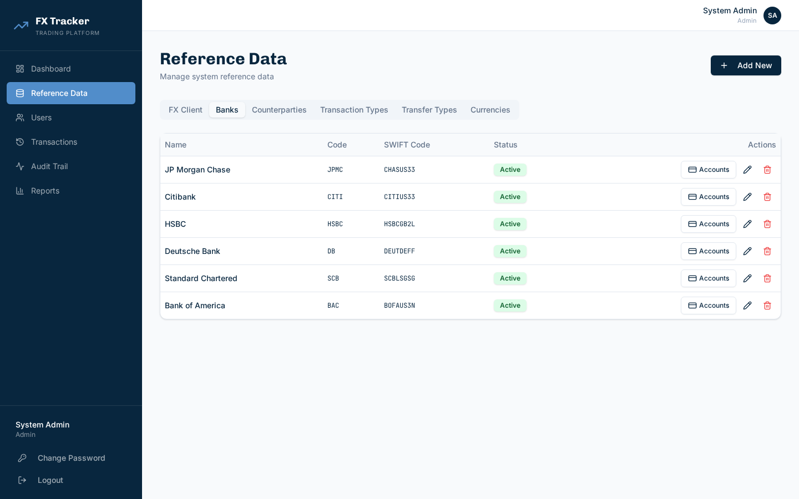

*Figure 7.3 - Banks tab showing the Accounts button for each bank*

Each bank row has an **Accounts** button to manage bank accounts.

1. Click **Accounts** on a bank row.
2. The Manage Accounts dialog opens.

**Adding an Account:**
- Enter **Account Name** (required) and **Account Number** (required).
- Click **Add**.

**Importing Accounts from CSV/Excel:**
1. Click **Import** in the dialog header.
2. Select a CSV or Excel file with these columns:

| Column | Required | Description |
|--------|----------|-------------|
| account_number | Yes | The bank account number |
| account_name | Yes | Descriptive account name (e.g., "USD Operating") |

3. Duplicate account numbers are automatically skipped.

**Example CSV:**
```
account_number,account_name
001-234-567,USD Operating Account
001-234-568,EUR Settlement Account
001-234-569,PHP Collection Account
```

### 7.6 Currencies

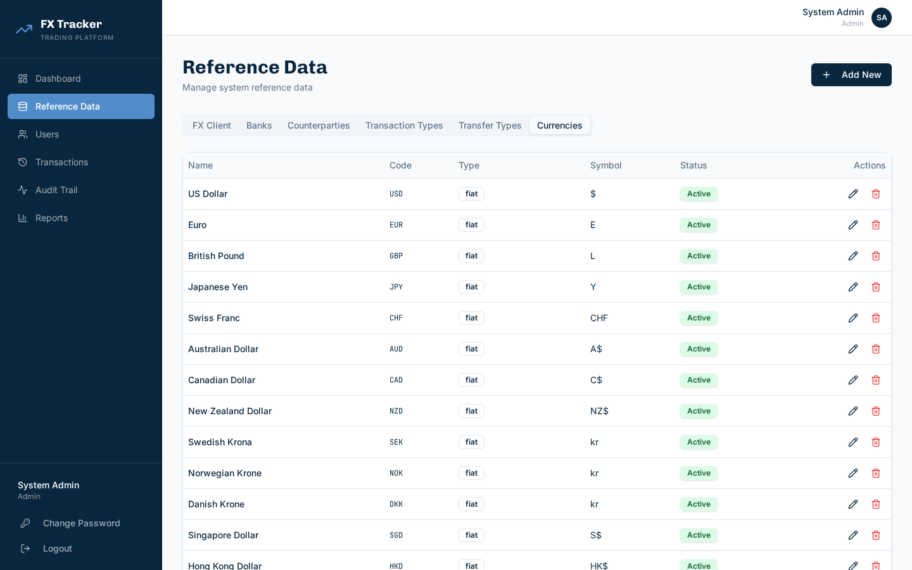

*Figure 7.4 - Currencies tab showing fiat, stablecoin, and crypto currencies*

The system comes pre-loaded with:
- **31 fiat currencies** (USD, EUR, GBP, PHP, etc.)
- **16 stablecoins** (USDT, USDC - "USD Circle", DAI, etc.)
- **18 cryptocurrencies** (BTC, ETH, SOL, etc.)

Each currency has a type badge (fiat / stablecoin / crypto) and symbol.

---

## 8. User Management (Admin)

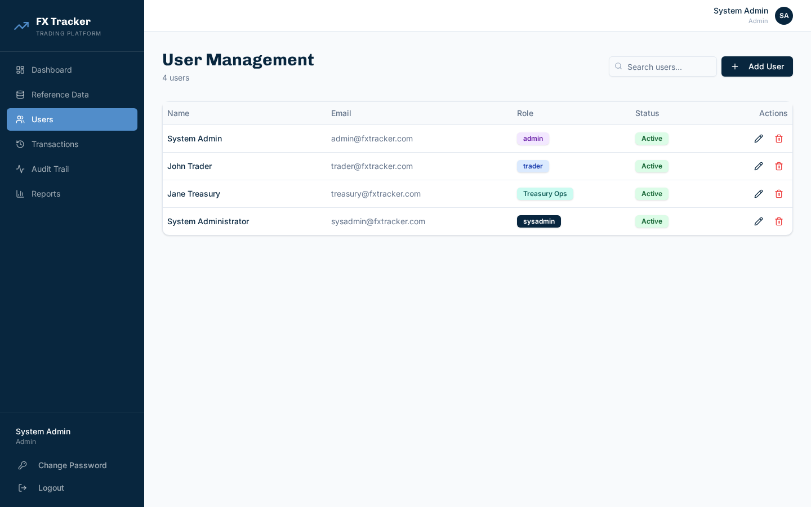

*Figure 8.1 - User Management page with role badges*

### 8.1 Viewing Users

The Users page displays all system users with their name, email, role, and status. Use the search bar to find users by name or email.

### 8.2 Adding a User

1. Click **Add User**.
2. Fill in:
   - First Name, Last Name
   - Email address
   - Password
   - Role (Trader, Treasury, or Admin)
3. Click **Create**.

### 8.3 Editing a User

Click the pencil icon to edit user details. You can update:
- Name, email, role
- Active/inactive status
- Password (optional)

### 8.4 Deleting a User

Click the trash icon and confirm to delete a user.

---

## 9. Transaction History (Admin)

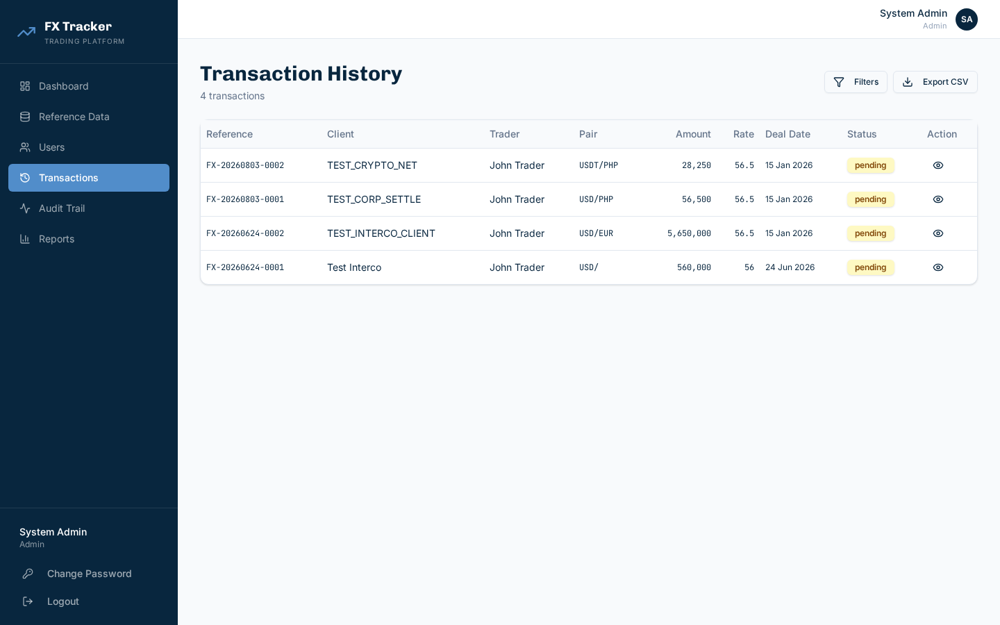

*Figure 9.1 - Transaction History showing all deals across the system*

The Transaction History page provides admins a system-wide view of all deals. Each row shows the reference, client, trader, currency pair, amount, rate, deal date, and status.

Click the eye icon to view full deal details. Use **Filters** to narrow results and **Export CSV** to download the data.

---

## 10. Audit Trail (Admin)

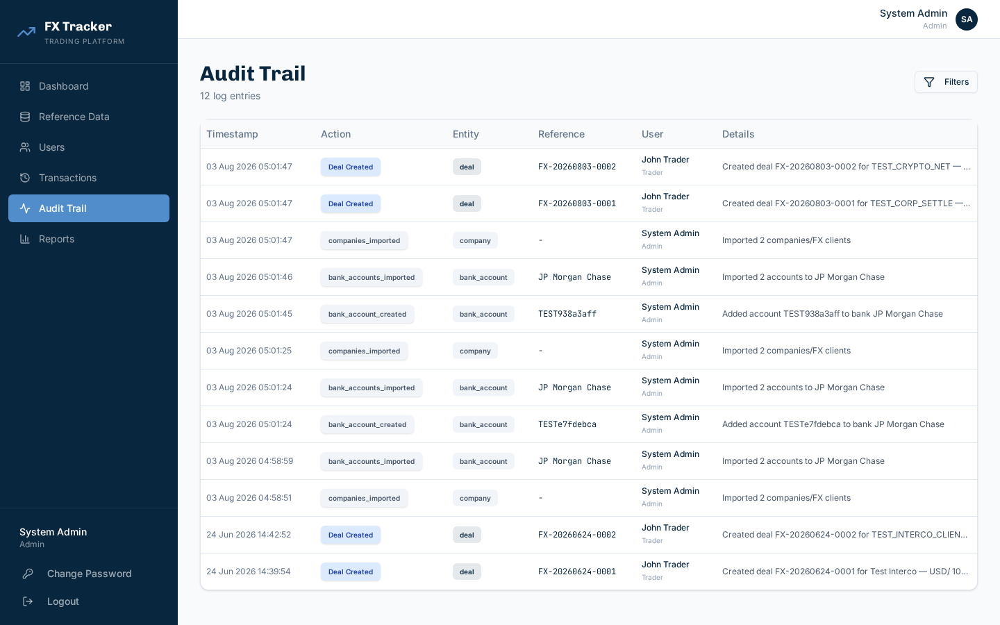

*Figure 10.1 - Audit Trail showing timestamped actions across the system*

The Audit Trail records every significant action in the system, including:
- Deal creation, confirmation, return, cancellation
- Settlement proof uploads and deletions
- User management actions
- Reference data changes (including bulk imports)
- Password changes

### 10.1 Columns

| Column | Description |
|--------|-------------|
| **Timestamp** | Date and time of the action |
| **Action** | Type of action (Deal Created, Proof Uploaded, etc.) |
| **Entity** | What was affected (deal, user, bank_account, company) |
| **Reference** | Reference number or identifier |
| **User** | Who performed the action (name and role) |
| **Details** | Human-readable description |

### 10.2 Filtering

Click **Filters** to filter by:
- Action type
- Entity type
- User name
- Date range

---

## 11. Reports

The Reports page provides access to eight pre-built reports for operational analysis.

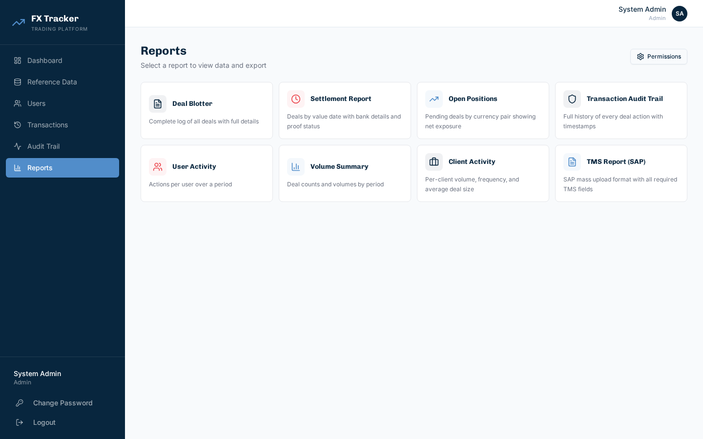

*Figure 11.1 - Reports page showing available report cards*

### 11.1 Available Reports

| Report | Description | Key Filters |
|--------|-------------|-------------|
| **Deal Blotter** | Complete log of all deals with full details | Date, status, client, currency |
| **Settlement Report** | Deals by value date with bank details and proof status | Date, from/to bank |
| **Open Positions** | Pending deals grouped by currency pair showing net exposure | None (always current pending) |
| **Transaction Audit Trail** | Full history of every deal action with timestamps | Date, user name |
| **User Activity** | Actions per user over a period | Date range |
| **Volume Summary** | Deal counts and volumes grouped daily, weekly, or monthly | Date range, grouping |
| **Client Activity** | Per-client volume, frequency, and average deal size | Date range, client |
| **TMS Report (SAP)** | 21-column SAP mass upload format with all required TMS fields | Date range |

### 11.2 Viewing Reports On-Screen

1. Click on any report card.
2. A data table will load with the report results.
3. Use the filter controls and date range to refine results.
4. Server-side pagination is provided for large datasets.

### 11.3 Exporting Reports

Each report can be exported in two formats:
- **CSV** - Comma-separated values for spreadsheet use.
- **PDF** - Formatted PDF document with company branding.

Click the **Export CSV** or **Export PDF** button to download.

### 11.4 Report Permissions

Admins can control which roles have access to each report:
1. Click the **Permissions** button on the Reports page.
2. Toggle report access for Trader, Treasury, and Admin roles.
3. Click **Save**.

### 11.5 FX-Intercompany Handling

For FX-Intercompany deals, the Settlement and TMS reports generate dual lines:
- Reference ending in **.1** for the Sell side
- Reference ending in **.2** for the Buy side

---

## 12. System Administration

> **Note**: The System page is only accessible to users with the **sysadmin** role.

### 12.1 Database Statistics

View record counts for all collections (deals, users, audit logs, reference data, etc.).

### 12.2 Data Export

Export any collection as CSV or JSON:
- Deals, Audit Logs, Users
- Companies, Banks, Bank Accounts
- Currencies, Transaction Types, Transfer Types
- Counterparties

### 12.3 Database Reset

Perform a controlled reset of transactional data:
- **Cleared**: Deals, audit logs, counters, report permissions.
- **Retained**: Users, reference data, bank accounts.

To reset:
1. Navigate to the System page.
2. Type `RESET DATABASE` in the confirmation field.
3. Click **Reset**.

> **Warning**: This action is irreversible. All deal and audit data will be permanently deleted.

---

## 13. Appendix: Transfer Types Reference

| Transfer Type | Code | Counterparty Field | Destination Section | Notes |
|---------------|------|-------------------|---------------------|-------|
| FX Crypto Conversion | FX_CRYPTO | No (uses Company) | Yes | Standard crypto conversion |
| FX Local | FX_LOCAL | Yes | Yes | Shows Counterparty instead of Company |
| PDAX Withdrawal | PDAX_WD | No (uses Company) | Yes | PDAX-specific withdrawal |
| FX Bank Deal | FX_BANK | No (uses Company) | No (hidden) | Destination not applicable |
| FX-Intercompany | FX_INTERCO | Yes | Yes | Dual Ours sections (Selling + Buying) |
| FX - Corporate Settlement | FX_CORP_SETTLE | Yes | Yes | Behaves like FX Local |

### Crypto Network Support

When any account section (Source, Destination, Ours) is set to **Crypto** mode, a **Network** dropdown is required:

| Network | Blockchain |
|---------|-----------|
| SOLANA | Solana blockchain |
| ETHEREUM | Ethereum blockchain (including ERC-20 tokens) |
| TRON | TRON blockchain (including TRC-20 tokens) |

The selected network is stored per-section as `from_network`, `to_network`, `ours_network`, and `buying_ours_network`.

---

## Appendix: Keyboard Shortcuts

| Shortcut | Action |
|----------|--------|
| `Esc` | Close any open dialog |
| `Enter` | Submit the active form |
| `Tab` | Navigate between form fields |

---

## Appendix: Status Workflow

```
                    +---> Confirmed
                    |
Created ---> Pending ----+
                    |    |
                    +---> Returned ---> (Edit) ---> Pending
                    |
                    +---> Cancelled
```

- **Pending**: New deal awaiting treasury review.
- **Confirmed**: Treasury has approved the deal.
- **Returned**: Treasury has sent the deal back for corrections.
- **Cancelled**: Trader has recalled/cancelled the deal.

---

*End of User Manual*
